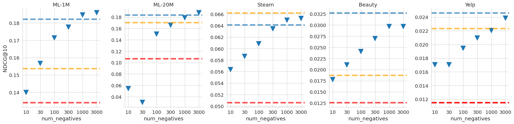
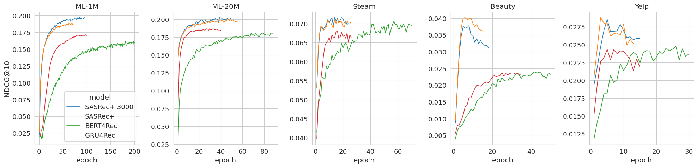

# Turning Dross Into Gold Loss: Is BERT4Rec really better than SASRec?

This repository contains code for ACM RecSys 2023 paper ["Turning Dross Into Gold Loss: Is BERT4Rec really better than SASRec?"](https://arxiv.org/abs/2309.07602) by Anton Klenitskiy and Alexey Vasilev.


## Abstract

Recently sequential recommendations and next-item prediction task has become increasingly popular in the field of recommender systems. Currently, two state-of-the-art baselines are Transformerbased models SASRec and BERT4Rec. Over the past few years, there have been quite a few publications comparing these two algorithms and proposing new state-of-the-art models. In most of the publications, BERT4Rec achieves better performance than SASRec. But BERT4Rec uses cross-entropy over softmax for all items, while SASRec uses negative sampling and calculates binary cross-entropy loss for one positive and one negative item. In our work, we show that if both models are trained with the same loss, which is used by BERT4Rec, then SASRec will significantly outperform BERT4Rec both in terms of quality and training speed. In addition, we show that SASRec could be effectively trained with negative sampling and still outperform BERT4Rec, but the number of negative examples should be much larger than one.

## Main paper results

Original SASRec used binary cross-entropy loss for one positive and one negative example:
```math
\mathcal{L}_{BCE} = -\sum_{u \in U} \sum_{t=1}^{n_u} \log(\sigma (r_{t,i_t}^{(u)})) + \log(1-\sigma(r_{t,-}^{(u)})).
```
We suggest to use instead cross-entropy loss, which is used by BERT4Rec:
```math
    \mathcal{L}_{CE} = -\sum_{u \in U} \sum_{t \in T_u} \log \frac{\exp(r_{t,i_t}^{(u)})}{\sum_{i \in I} \exp(r_{t,i}^{(u)})}.
```
When the number of items is large, it is computationally expensive to calculate softmax and cross-entropy loss over full set of items. To avoid this problem it is possible to use negative sampling. For each user sequence in a batch, we sample $N$ items
a user hasn’t interacted with and use the same set of negatives for
each time step of a given sequence:
```math
    \mathcal{L}_{CE-sampled} = -\sum_{u \in U} \sum_{t=1}^{n_u} \log \frac{\exp(r_{t,i_t}^{(u)})}{\exp(r_{t,i_t}^{(u)}) + \sum_{i \in I^{-(u)}_N} \exp(r_{t,i}^{(u)})},
```

---

We conduct experiments on five popular datasets, which are often used as sequential recommendations benchmarks. MovieLens-1m, MovieLens-20m, Steam and Amazon Beauty have been used in original BERT4Rec publication, and we use exactly the same preprocessed versions of datasets from the [BERT4Rec repository](https://github.com/FeiSun/BERT4Rec/tree/master/data). Preprocessing for Yelp dataset is in notebook `notebooks/Yelp_data.ipynb`.

For evaluation we use leave-one-out approach. For each user, the last item of the interaction sequence is used as the test data, the item before the last one is used as the validation data, and the remaining data is used for training.

Below are the tables with main results for different datasets. `SASRec+` stands for SASRec with cross-entropy loss $`\mathcal{L}_{CE}`$, `SASRec+ 3000` - SASRec with sampled cross-entropy loss $`\mathcal{L}_{CE-sampled}`$ with 3000 negative examples.

**MovieLens-1m**

| **Model**          | **HitRate@10**     | **NDCG@10**        | **Training time** | **Best epoch** |
|--------------------|--------------------|--------------------|-------------------|----------------|
| BERT4Rec           | 0.2843             | 0.1537             | 1409              | 197            |
| SASRec             | 0.2500             | 0.1341             | 486               | 53             |
| SASRec+ (our)      | 0.3152             | 0.1821             | 540               | 63             |
| SASRec+ 3000 (our) | **0.3159**         | **0.1857**         | 769               | 85             |

**MovieLens-20m**

| **Model**          | **HitRate@10**     | **NDCG@10**        | **Training time** | **Best epoch** |
|--------------------|--------------------|--------------------|-------------------|----------------|
| BERT4Rec           | 0.2816             | 0.1703             | 14758             | 68             |
| SASRec             | 0.2001             | 0.1067             | 2495              | 30             |
| SASRec+ (our)      | 0.2983             | 0.1833             | 9959              | 46             |
| SASRec+ 3000 (our) | **0.3090**         | **0.1872**         | 4125              | 39             |

**Steam**

| **Model**          | **HitRate@10**     | **NDCG@10**        | **Training time** | **Best epoch** |
|--------------------|--------------------|--------------------|-------------------|----------------|
| BERT4Rec           | **0.1242**         | **0.0662**         | 4893              | 74             |
| SASRec             | 0.0981             | 0.0506             | 2140              | 39             |
| SASRec+ (our)      | 0.1191             | 0.0641             | 1262              | 16             |
| SASRec+ 3000 (our) | 0.1206             | 0.0652             | 1226              | 14             |

**Amazon Beauty**

| **Model**          | **HitRate@10**     | **NDCG@10**        | **Training time** | **Best epoch** |
|--------------------|--------------------|--------------------|-------------------|----------------|
| BERT4Rec           | 0.0338             | 0.0187             | 2325              | 87             |
| SASRec             | 0.0246             | 0.0126             | 521               | 26             |
| SASRec+ (our)      | **0.0533**         | **0.0327**         | 332               | 6              |
| SASRec+ 3000 (our) | 0.0490             | 0.0295             | 296               | 8              |

**Yelp**

| **Model**          | **HitRate@10**     | **NDCG@10**        | **Training time** | **Best epoch** |
|--------------------|--------------------|--------------------|-------------------|----------------|
| BERT4Rec           | 0.0442             | 0.0223             | 10166             | 21             |
| SASRec             | 0.0228             | 0.0115             | 655               | 3              |
| SASRec+ (our)      | **0.0482**         | **0.0246**         | 2505              | 3              |
| SASRec+ 3000 (our) | 0.0462             | 0.0237             | 1965              | 5              |

Perofrmance for a different number of negative examples:

Markers represent NDCG10 for a corresponding number of negatives. SASRec+ (blue line), SASRec (red line), and BERT4Rec (orange line) are added for comparison. It is clear that we need a lot of negatives to reach good results.

The following plot shows that BERT4Rec needs much more training time and epochs to converge:


## Usage

Install requirements:
```sh
pip install -r requirements.txt
```

For configuration we use [Hydra](https://hydra.cc/). Parameters are specified in [config files](src/configs/), they can be overriden from the command line. Optionally it is possible to use [ClearML](`https://clear.ml/docs/latest/docs`) for experiments logging (`project_name` and `task_name` should be specified in config to use ClearML).

Example of run via command line:
```sh
cd src
python run.py --config-name=SASRec data_path=../data/ml-1m.txt 
```

There is an [Example notebook](notebooks/Example.ipynb), you can try to run it on datasets from `data/` folder or on your data.


Note: currently (in September 2023) this code doesn't work with `python>=3.10`, because `recommenders` library which is used for evaluation needs `python<3.10`.

## Reproduce paper results

Scripts to reproduce main results:

```sh
cd src/

# MovieLens-1m

# SASRec+
python run.py --config-name=SASRec data_path=../data/ml-1m.txt dataset.max_length=200
# SASRec+ 3000
python run.py --config-name=SASRec data_path=../data/ml-1m.txt dataset.max_length=200 +dataset.num_negatives=3000
# SASRec vanilla
python run.py --config-name=SASRec data_path=../data/ml-1m.txt dataset.max_length=200 +seqrec_module.loss=bce +dataset.num_negatives=1 dataset.full_negative_sampling=True
# GRU4Rec
python run.py --config-name=RNN data_path=../data/ml-1m.txt dataset.max_length=200
# BERT4Rec
python run.py --config-name=BERT4Rec data_path=../data/ml-1m.txt dataset.max_length=200

# MovieLens-20m

# SASRec+
python run.py --config-name=SASRec data_path=../data/ml-20m.txt dataset.max_length=200 model_params.hidden_units=256
# SASRec+ 3000
python run.py --config-name=SASRec data_path=../data/ml-20m.txt dataset.max_length=200 +dataset.num_negatives=3000 model_params.hidden_units=256
# SASRec vanilla
python run.py --config-name=SASRec data_path=../data/ml-20m.txt dataset.max_length=200 +seqrec_module.loss=bce +dataset.num_negatives=1 dataset.full_negative_sampling=True model_params.hidden_units=256
# GRU4Rec
python run.py --config-name=RNN data_path=../data/ml-20m.txt dataset.max_length=200 model_params.input_size=256 model_params.hidden_size=256
# BERT4Rec
python run.py --config-name=BERT4Rec data_path=../data/ml-20m.txt dataset.max_length=200 model_params.hidden_size=256

# Amazon Beauty

# SASRec+
python run.py --config-name=SASRec data_path=../data/beauty.txt
# SASRec+ 3000
python run.py --config-name=SASRec data_path=../data/beauty.txt +dataset.num_negatives=3000
# SASRec vanilla
python run.py --config-name=SASRec data_path=../data/beauty.txt +seqrec_module.loss=bce +dataset.num_negatives=1 dataset.full_negative_sampling=True
# GRU4Rec
python run.py --config-name=RNN data_path=../data/beauty.txt
# BERT4Rec
python run.py --config-name=BERT4Rec data_path=../data/beauty.txt

# Steam

# SASRec+
python run.py --config-name=SASRec data_path=../data/steam.txt
# SASRec+ 3000
python run.py --config-name=SASRec data_path=../data/steam.txt +dataset.num_negatives=3000
# SASRec vanilla
python run.py --config-name=SASRec data_path=../data/steam.txt +seqrec_module.loss=bce +dataset.num_negatives=1 dataset.full_negative_sampling=True
# GRU4Rec
python run.py --config-name=RNN data_path=../data/steam.txt
# BERT4Rec
python run.py --config-name=BERT4Rec data_path=../data/steam.txt

# Yelp

# SASRec+
python run.py --config-name=SASRec data_path=../data/yelp.txt
# SASRec+ 3000
python run.py --config-name=SASRec data_path=../data/yelp.txt +dataset.num_negatives=3000
# SASRec vanilla
python run.py --config-name=SASRec data_path=../data/yelp.txt +seqrec_module.loss=bce +dataset.num_negatives=1 dataset.full_negative_sampling=True
# GRU4Rec
python run.py --config-name=RNN data_path=../data/yelp.txt
# BERT4Rec
python run.py --config-name=BERT4Rec data_path=../data/yelp.txt
```

BPR-MF code is in a separate notebook `notebooks/BPR-MF.ipynb`.


## Citing

If this work was useful in your research, please consider citing our paper:
```
@inproceedings{klenitskiy2023turning,
  title={Turning Dross Into Gold Loss: is BERT4Rec really better than SASRec?},
  author={Klenitskiy, Anton and Vasilev, Alexey},
  booktitle={Proceedings of the 17th ACM Conference on Recommender Systems},
  pages={1120--1125},
  year={2023}
}
```
